# Automatizacija razvojnog okruženja korišćenjem dotfiles repozitorijuma, GitHub-a i alatki za upravljanjem konfiguracijom (Chezmoi)

**Infrastruktura kao kod za lično razvojno okruženje.** *Upravljanje konfiguracijom, automatizacija i instalacija i multi-OS podrška*

## Sadržaj

1. [O projektu](#o-projektu)
2. [Motivacija i problem](#motivacija-i-problem)
3. [Šta su Dotfajlovi](#šta-su-dotfajlovi)
4. [Arhitektura Rešenja](#arhitektura-rešenja)
    - [Šta su Simbolički linkovi](#šta-su-simbolički-linkovi)
    - [Chezmoi](#chezmoi)
5. [Ključne funkcionalnosti](#ključne-funkcionalnosti)
6. [Uputstvo za Instalaciju](#uputstvo-za-instalaciju)
    - [Brzi početak (One-Liner)](#brzi-početak-one-liner)
    - [Napravi svoj dotfile repozitorijum](#napravi-svoj-dotfile-repozitorijum)
7. [Tok rada](#tok-rada)
    - [Dodavanje fajla](#dodavanje-fajla-za-upravljanje-od-strane-chezmoi)
    - [Uređivanje fajla](#uređivanje-fajla)
    - [Primena izmena](#primena-izmena)
8. [Šabloni](#šabloni)
    - [Kako dodati šablon](#kako-dodati-šablon)
    - [Sintaksa i logika](#sintaksa-i-logika)
9. [Promenljive i kontekst](#promenljive-i-kontekst-chezmoitoml)
10. [Skripte i automatizacija](#skripte-i-automatizacija)
    - [Vrste skripti (Hooks)](#vrste-skripti-hooks)
    - [Tok podataka](#tok-podataka-1)
    - [Upravljanje korisničkim skriptama](#upravljanje-korisničkim-skriptama)
11. [Git tok rada](#git-tok-rada-čuvanje-izmena)
12. [Zaključak](#zaključak)
13. [Reference](#reference)


## O projektu

Ovaj repozitorijum sadrži kompletnu konfiguraciju mog razvojnog okruženja (tzv. dotfiles), kojom upravlja alat Chezmoi. Projekat demonstrira primenu principa "Infrastrukture kao koda" na ličnom računaru, omogućavajući verzionisanje, bekapovanje i automatizovano podešavanje novih mašina.

Cilj projekta je eliminisati ručno kopiranje fajlova i omogućiti postavljanje potpuno funkcionalnog okruženja za manje od 60 sekundi.

## Motivacija i problem

Glavna motivacija za ovaj projekat proistekla je iz problema prenosa mog radnog okruženja, koje sam usavršavao preko 5 godina.

Takođe sam dobio potrebu da razvijam softver na dve mašine: moj lični laptop koji koristi Ubuntu Linux OS, kao i poslovni laptop koji radi na MacOS-u.

Problemi sa kojima sam se suočio su:

* Odstupanje konfiguracije (Config Drift): Vremenom se konfiguracije na različitim mašinama razilaze, što dovodi do problema "radi na mojoj mašini, ali ne na tvojoj". Konkretno, pošto veliku većinu vremena koristim moj lični računar, a povremeno svoj privatni laptop, dešava se da vremenom dolazi do razilaženja konfiguracija na ova dva laptopa.

* Oporavak: Ručno podešavanje nove mašine nakon kvara može trajati danima. Cilj je smanjiti to vreme na minute. U toku prvog meseca rada u novoj kompaniji, nakon inicijalnog podešavanja mog razvojnog okruženja desilo se, greškom, da je tehnička podrška vratila moj laptop na fabrička podešavanja u toku radnog vremena. Zato što nisam imao konfiguraciju sačuvanu, bilo mi je potreban ceo radni dan da povratim svoje radno okruženje u radno stanje.

* Promena konteksta: Zaboravljanje aliasa i prečica pri prelasku sa jednog sistema na drugi. I dan danas se dešava da nailazim na prečice koje su radile na mom starom poslovnom laptopu, a koje ne rade na novom. Lako je to nadomestiti, ali mi je bilo potrebno da ponovo dođem do situacije da mi je prečica potrebna i da se setim kako sam je podesio.

* Drugačije komande i aplikacije na različitim OS-ovima: Neke aplikacije su dostupne na Linux-u, dok nisu dostupne na MacOS-u. Takođe i određene komande nisu iste. Bio mi je potreban način da simultano podesim rad na oba OS-a što brže.

## Šta su Dotfajlovi

Dotfajlovi su skriveni konfiguracioni fajlovi (koji počinju sa tačkom (.)) u Unix sistemima. Koriste se za konfigurisanje aplikacija, shell-ova (Bash, Zsh, Fish), i alata (kao Git, Vim) tako što čuvaju podešavanja korisnika, prečice i promenljive okruženja (environment variables). Uglavnom se nalaze u home direktorijumu (**~/**).

```bash
markoilic@laptop:~$ ls -la
.
..
.config/      <-- Folder sa konfiguracijama
.gitconfig    <-- Tvoj Git identitet
.ssh/         <-- Tvoji ključevi
.vimrc        <-- Vim editor podešavanja
.zshrc        <-- Zsh shell podešavanja
Documents/
Downloads/
```

## Arhitektura Rešenja

Za razliku od tradicionalnih rešenja zasnovanih na simboličkim linkovima (kao što je GNU Stow), koja su krhka i ne podržavaju lako varijacije između operativnih sistema, ovaj projekat koristi Chezmoi.

### Šta su Simbolički linkovi

Simbolički link (symlink) je kao prečica koja pokazuje na neki drugi fajl ili folder.

Kada otvoriš symlink, računar se ponaša kao da si otvorio originalni fajl, iako je on zapravo na drugom mestu.

To je korisno jer možeš da držiš fajlove uredno organizovane (na primer u Git repozitorijumu), a da ih koristiš kao da su svuda gde ti trebaju (kao što se dotfajlovi nalaze svuda razbacanim u home direktorijumu).

#### Primer

Ako imaš fajl `~/.zshrc` koji zapravo živi u nekom folderu sa konfiguracijama, možeš napraviti symlink:

```bash 
ln -s ~/repositories/dotfiles/dot_zshrc ~/.zshrc
```

Sada svaki program misli da koristi `~/.zshrc`, ali se pravi fajl čuva u `~/repositories/dotfiles`.

```bash
# Primer organizacije dotfile git repozitorijuma.

dotfiles/
├── zsh/
│   └── dot_zshrc
│   └── dot_aliases
├── git/
│   └── dot_gitconfig
├── vim/
│   └── dot_vimrc
```

Na ovaj način možeš da organizuješ svoj dotfile repozitorijum kako god tebi najviše odgovara, a da pomoću simboličkih linkova on dobije strukturu neophodnu da aplikacije koje koriste određene dotfajlove mogu da ih koriste. Takođe dobijamo mogućnost da na lak način verzionišemo fajlove pomoću Git-a jer je mnogo praktičnije da direktorijum sadrži samo fajlove koje želimo da verzionišemo putem Git-a, nego da slučajno sačuvamo i neke druge (kao što bi se desilo kada bi ceo home direktorijum bio Git repozitorijum).

#### Glavne mane

Ako obrišeš direktorijum `~/repositories/dotfiles`, linkovi pucaju ("broken links") i shell se ne učitava.

Teško je imati različit sadržaj fajla za Mac i Linux jer fajl u repozitorijumu mora biti identičan za sve. Dok simlink zahteva identičan fajl svuda, Chezmoi koristi šablone koji mogu dinamički da odluče: 'Ako je ovo Mac, upiši X; ako je Linux, upiši Y'.

### Chezmoi

Za razliku od alata kao što je GNU Stow, Chezmoi ne korisi simboličke linkove kao mehanizam upravljanje dotfajlovima.

Arhitektura se zasniva na jednosmernom toku podataka:

1. Izvor (Source): `~/.local/share/chezmoi` (Git repozitorijum gde se čuvaju šabloni dotfajlova i logika izvršavanja).

2. Chezmoi Engine: Procesira šablone i generiše finalne dotfajlove, izvršava skripte i upravlja tajnama.

3. Odredište (Destination): ~ (Home direktorijum gde se generišu finalni fajlovi).

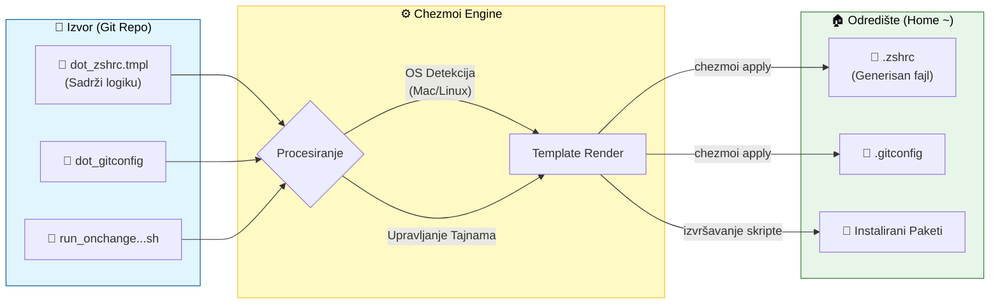

## Ključne funkcionalnosti

Ovaj projekat koristi napredne mogućnosti Chezmoi-a kako bi rešio navedene probleme:

1. **Multi-OS Podrška (Šabloni)**

Koristeći Go text/template sintaksu, jedan fajl se prilagođava operativnom sistemu.

Primer: `.zshrc` automatski detektuje OS i postavlja odgovarajuću komandu za clipboard (pbcopy na macOS-u ili xclip na Linux-u).

2. **Svest o Kontekstu (Context Awareness)**

Sistem prepoznaje da li se pokreće na poslovnom ili privatnom računaru putem interaktivnog upitnika (.chezmoi.toml.tmpl) i dinamički ubacuje odgovarajući email u .gitconfig.

3. **Automatizacija (Hooks)**

Instalacija Softvera (*run_onchange*): Skripte koje automatski instaliraju pakete (**git, tmux, neovim, ghostty**) kada se detektuje promena u listi paketa. Koristi *brew* na macOS i *apt* na Linux-u.

Jednokratna Podešavanja (*run_once*): Skripte koje se izvršavaju samo inicijalno, npr. promena shell-a na Zsh ili kloniranje repozitorijuma sa beleškama.

## Uputstvo za Instalaciju

Ovaj odeljak opisuje kako reprodukovati rezultate i podesiti okruženje na novoj mašini.

### Preduslovi

* Operativni sistem: macOS ili Linux (Ubuntu/Debian)
* Instalirani: `curl` i `git`

### Brzi početak (One-Liner)

Za potpunu automatsku instalaciju i korišćenje dotfajlova sa ovog repozitorijuma, pokreni sledeću komandu u svom terminalu:

```bash
sh -c "$(curl -fsLS get.chezmoi.io)" -- init --apply https://github.com/marezii/dotfiles.git
```

Ova komanda će uraditi sledeće:
1. Instalirati Chezmoi na tvoj OS.
2. Napraviti direktorijum `~/.local/share/chezmoi` koji će sadržati sve fajlove kojima upravljaš.
3. Klonirati sadržaj Git repozitorijum *https://github.com/marezii/dotfiles.git* u `~/.local/share/chezmoi` (u daljem tekstu Chezmoi dir).
4. Pokrenuti Chezmoi engine da se izvrše sve postojeće skripte, izgenerišu fajlovi od šablona i pokrenuće se interaktivni upitnik sa neophodnim pitanjima koje su potrebne Chezmoi-u.

**PAŽNJA: Ako odlučiš krenuti ovim korakom, obavezno napravi rezervne kopije svojih konfiguracionih fajlova zato što će chezmoi pregaziti postojeće fajlove za koje postoji šablon u Chezmoi dir-u.**

**Na primer: već koristiš `.zshrc`? Koristeći komandu:**
```bash 
mv .zshrc .zshrc.bak
``` 
**napravi kopiju jer moj dotfile repo sadrži svoju verziju *zsrhc* fajla.**

### Napravi svoj dotfile repozitorijum

Ako želiš da napraviš svoj dotfile repozitorijum pomoću Chezmoi, sledi sledeće korake

1. Instaliraj i inicijalizuj Chezmoi

```bash
sh -c "$(curl -fsLS get.chezmoi.io)" -- init
```

2. Pređi u Chezmoi repozitorijum u terminalu

```bash
# Komanda koja nas prebacuje u `~/.local/share/chezmoi`
# Alias za cd `~/.local/share/chezmoi`
chezmoi cd
```

3. Poveži Chezmoi sa svojim Git repozitorijumom

```bash
git remote add origin <REMOTE_URL> # REMOTE_URL je URL do tvog repozitorijum-a na nekoj Git platformi (GitHub, BitBucket, GitLab...)
```

*Dodatne instrukcije kako napraviti repozitorijum na GitHub-u: </br>https://docs.github.com/en/repositories/creating-and-managing-repositories/quickstart-for-repositories </br> https://docs.github.com/en/migrations/importing-source-code/using-the-command-line-to-import-source-code/adding-locally-hosted-code-to-github*


## Tok rada

U ovom delu će biti objašnjen osnovni tok rada sa dotfajlovima u Chezmoi-u.

### Dodavanje fajla za upravljanje od strane Chezmoi

```bash
# chezmoi add <PATH_TO_FILE> - PATH_TO_TILE je putanja do fajla koji želimo da dodamo da bude upravljan od strane Chezmoi-a
chezmoi add ~/.zshrc
```

Komanda *add* kopira fajl sadržaj izabranog fajla u Chezmoi direktorijum.

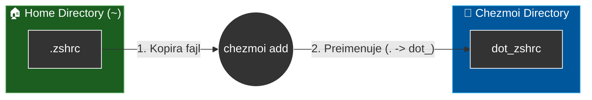

#### Konvencija imenovanja

Primetićeš kako svaki fajl koji daš Chezmoi-u na upravljanje će biti preimenovan.
Konvencija imenovanja je takva da će tačka (`.`) na početku imena fajla biti preimenovana `dot_`.

```
.zshrc -> dot_zshrc ✅ - Menja se *tačka* u *dot_*</br>.
script.sh -> script.sh ✅ - Ostaje tačka jer nije na početku imena fajla.
```

Ovo sprečava da fajlovi budu skriveni unutar Git repozitorijuma.

### Uređivanje fajla

Došlo je vreme da želiš da promeniš svoju konfiguraciju?
Iskoristi sledeću komandu:

```bash
# chezmoi edit <PATH_TO_FILE> - PATH_TO_FILE je putanja do fajla koji želimo da izmenimo, a trenutno je upravljan od strane Chezmoi-a
chezmoi edit ~/.zshrc
```

Kada pokreneš `chezmoi edit ~/.zshrc`, dešava se magija preusmeravanja. Iako si naveo putanju do fajla u Home direktorijumu, Chezmoi otvara izvorni fajl u repozitorijumu.

Ovim se osigurava da menjaš "Izvor Istine" (Source of Truth), a ne lokalnu kopiju koja bi kasnije bila pregažena.

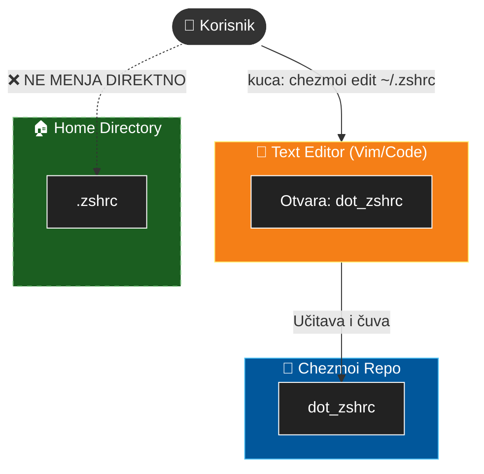

### Primena izmena

Chezmoi *edit* komanda nije dovoljna da izmene budu vidljive. Pošto *edit* komanda zapravo uređuje tekst koji se nalazi u Chezmoi direktorijumu, potrebno je tu promenu napraviti vidljivom u Home direktorijumu. Ovo postižemo pomoću sledeće komande:

```bash
chezmoi apply
```

Chezmoi *apply* je jako moćna komanda. Ona pokreće Chezmoi engine koji zapravo generiše konačne fajlove od šablona, pokreće izvršne skripte, umeće varijable u konačne fajlove... U daljim sekcijama pokazaću šta sve ova komanda radi.

Za sada je bitno znati sledeće:

Sadržaj fajlova u Home direktorijumu će biti pregaženi sadržajem koji se nalazi u fajlovima u Chezmoi direktorijumu. </br> **Zato je jako bitno biti oprezan kada se pokreće ova komanda. Da slučajno ne obrišemo ili izmenimo neki sadržaj koji ne želimo. Preporuka je pre svake *apply* komande izvršiti:**

```bash 
# chezmoi diff <PATH_TO_FILE>
chezmoi diff ~/.zshrc
```

Ova komanda će prikazati razliku između sadržaja fajlova u Chezmoi direktorijumu i Home direktorijumu. Na taj način možeš proveriti da li zaista želiš izvršiti primenu izmena.

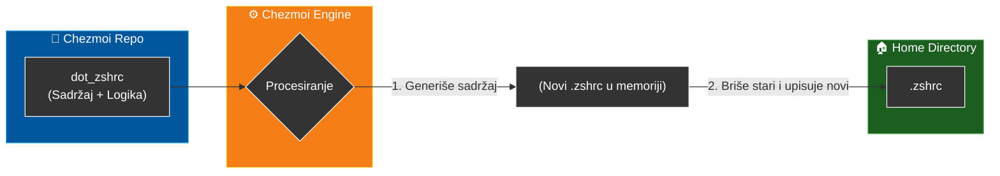

## Šabloni

Šabloni su jedna od najmoćnijih funkcionalnosti Chezmoi-a. Oni omogućavaju da jedan fajl u repozitorijumu generiše različit sadržaj u zavisnosti od okruženja u kojem se nalazi (MacOS vs Linux, Poslovni vs Privatni računar).

#### Zašto koristiti šablone?

**Primer 1:** Razlike između OS-ova MacOS koristi `pbcopy` za clipboard, dok Linux koristi `xclip`. Umesto da održavaš dva različita `.zshrc` fajla, koristiš jedan šablon sa if/else logikom.

**Primer 2:** Razlike u paketima MacOS koristi *homebrew*, dok Ubuntu koristi *apt*.

#### Kako dodati šablon

Postoje dva načina da fajl postane šablon:

1. Pri dodavanju *add* komande specificiraš da će fajl biti šablon (da će sadržati neku logiku izvršavanja)

```bash
chezmoi add --template ~/.zshrc
```

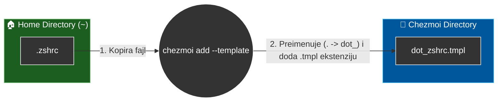

2. Ručno dodavanje *.tmpl* ekstenzije

```bash
chezmoi cd # Premestiš se u Chezmoi dir
mv dot_zshrc dot_zshrc.tmpl # Dodaš .tmpl ekstenziju
```

**VAŽNO: .tmpl ekstenzija je jako bitna. One govori chezmoi engine-u da u fajlu postoji logika koja je potrebna da se izvrši. Bez .tmpl ekstenzije, chezmoi engine tretira fajl kao običan tekst i neće procesirati logiku. Fajl može biti loš.**

#### Sintaksa i logika

Chezmoi koristi **Go text/templates** sintaksu. Sve što se nalazi unutar dvostrukih vitičastih zagrada `{{ ... }}` se izvršava kao kod.

##### Primer logike (dot_zshrc.tmpl)

```bash
# Definišeš alias u zavisnosti od operativnog sistema
alias copy=”
{{ if eq .chezmoi.os "darwin" }}
    pbcopy
{{ else if eq .chezmoi.os "linux" }}
    xclip -selection clipboard
{{ end }}”
```

### Vizuelizacija procesiranja

Evo kako Chezmoi pretvara jedan šablon u ispravnu komandu za tvoj OS:

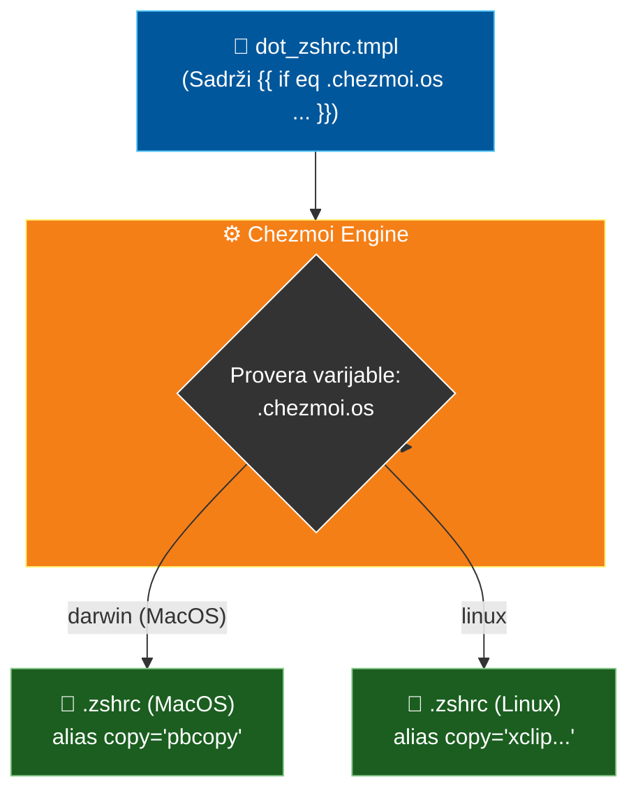

### Korisne ugrađene promenljive

Chezmoi pruža niz ugrađenih promenljivih koje možeš koristiti u `{{ }}` blokovima za donošenje odluka:

| Promenljiva  | Opis  |  Primer vrednosti |
|---|---|---|
|`.chezmoi.os`   | Operativni sistem  | `darwin`, `linux`, `windows`  |
|`.chezmoi.arch`   | Arhitektura procesora  | `amd64`, `arm64`  |
|`.chezmoi.username`   | Trenutno korisničko ime  | `marko`  |
|`.chezmoi.hostname`   | Ime računara  | `marko-macbook`  |

*Osim ovih, možeš definisati i svoje sopstvene varijable (npr. is_work_laptop = true) u konfiguracionom fajlu .chezmoi.toml.*

## Promenljive i kontekst (.chezmoi.toml)

Dok nam `.chezmoi.os` (koji je ugrađen) govori na kom sistemu smo, često nam trebaju podaci o tome ko smo ili gde smo. Na primer:

Koji email da koristim za Git? (Privatni vs Poslovni)

Da li da instaliram zabavne alate (Spotify, Discord) ili samo poslovne?

Ovo rešavaš pomoću konfiguracionog fajla.

### Kako ovo radi?

Chezmoi koristi specijalan fajl `.chezmoi.toml.tmpl` u repozitorijumu. Kada pokreneš `chezmoi init`, Chezmoi će te "intervjuisati" na osnovu pitanja definisanih u tom fajlu i generisati lokalni konfiguracioni fajl `.chezmoi.toml`.

#### VAŽNA RAZLIKA:
* `.chezmoi.toml.tmpl`: Nalazi se u Gitu. Sadrži pitanja.

* `.chezmoi.toml`: Nalazi se u tvom Home direktorijumu (`~/.config/chezmoi/chezmoi.toml`). Sadrži tvoje odgovore. Ovaj fajl se NE čuva u Gitu (ignorisan je) jer je specifičan za tu mašinu.

### Kreiranje upitnika

Prvo praviš šablon konfiguracionog fajla u Chezmoi direktorijumu:

```bash
chezmoi cd
touch .chezmoi.toml.tmpl
```

U njega upisuješ logiku i pitanja:

```bash
# .chezmoi.toml.tmpl

# Definišeš promenljivu za email
{{- $email := promptString "Koji je tvoj Git email?" -}}

# Definišeš boolean za poslovni laptop
{{- $is_work := promptBool "Da li je ovo poslovni racunar?" -}}

[data]
    email = {{ $email | quote }} # | quote dodaje oko promenljive email navodnike. marko@gmail.com -> "marko@gmail.com"
    is_work = {{ $is_work }}
```

### Tok podataka

Evo šta se dešava kada prvi put pokreneš Chezmoi na novoj mašini:

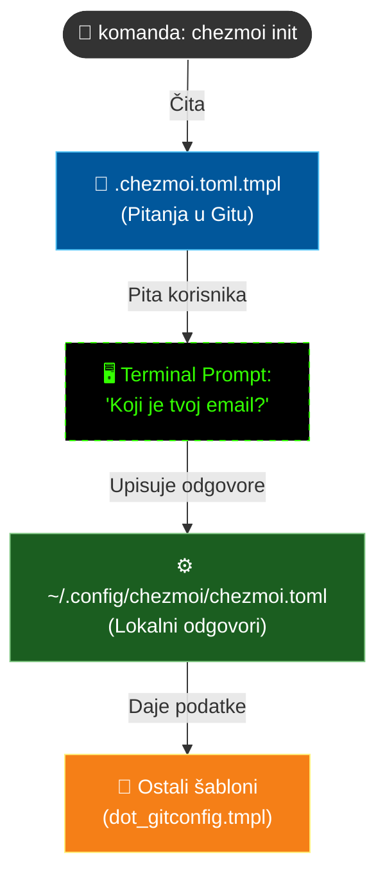

### Korišćenje u fajlovima

Sada kada imaš sačuvane odgovore u data sekciji, možeš ih koristiti u bilo kom drugom fajlu.

**Primer: `.gitconfig` koji se menja u zavisnosti od odgovora**

```bash
# dot_gitconfig.tmpl
[user]
    name = Marko Ilic
    email = {{ .email }}  <-- Ubacuje uneti email

[core]
    editor = vim

{{ if .is_work }}
# Ovo se dodaje SAMO ako si odgovorio "true" za poslovni računar
[http]
    proxy = http://proxy.firma.com:8080
{{ end }}
```

Na ovaj način postižeš potpuni Context Awareness. Ista komanda `chezmoi apply` kreira različitu konfiguraciju u zavisnosti od toga šta si odgovorio pri inicijalizaciji.

## Skripte i automatizacija

Podešavanje okruženja nije samo konfiguracija dotfajlova. Automatizovano preuzimanje softvera, kloniranje Git repozitorijuma, podešavanje podrazumevanog shell-a je takođe bitan proces podeša razvojnog okruženja i super je što Chezmoi pomaže da se i ovaj deo uradi na lak način. Ovo je moguće uraditi pomoću skripti.

Chezmoi skripte su obični fajlovi u repozitorijumu (Bash, Python, itd.) koji se izvršavaju kada se pokrene `chezmoi apply`.

*Sličan rezultat je moguće postići i korišćenjem regularnih shell skripi i GNU Stow, ali bez benefita automatskog pokretanja skripti i podešavanja kada će se koja skripta izvršiti. Takođe se ne može iskoristiti benefit promenljivih i šablona.*

### Vrste skripti (Hooks)

Chezmoi prepoznaje kada treba da pokrene skriptu na osnovu prefiksa u imenu fajla:

| Prefiks  | Ponašanje  |  Primer primene |
|---|---|---|
|`run_once_`   | Izvršava se **samo jednom** (i nikad više, osim ako se ne obriše iz baze).  | Inicijalno podešavanje (npr. postavljanje Zsh kao default shell-a).  |
|`run_onchange_`   | Izvršava se svaki put kada se **sadržaj fajla promeni** (promeni se hash).  | Instalacija paketa (pokreće se ponovo samo ako dodaš novi paket u listu).  |
|`run_before_`   | Izvršava se **pre** nego što Chezmoi primeni izmene na dotfajlove.  | Dekriptovanje tajni, priprema direktorijuma.  |
|`run_after_`   | Izvršava se posle **uspešne** primene svih izmena.  | Čišćenje, kompajliranje, ispis poruke o uspehu.  |

### Gde i kako kreirati skripte?

Sve skripte moraju biti u Chezmoi direktorijumu, tj. `~/.local/share/chezmoi`.

```bash
chezmoi cd
```

U Chezmoi direktorijumu se kreiraju skripte:

```bash
touch run_onchange_install_packages.sh.tmpl
```

### Tok podataka

Kada se pokrene `chezmoi apply`, redosled izvršavanja izgleda ovako:

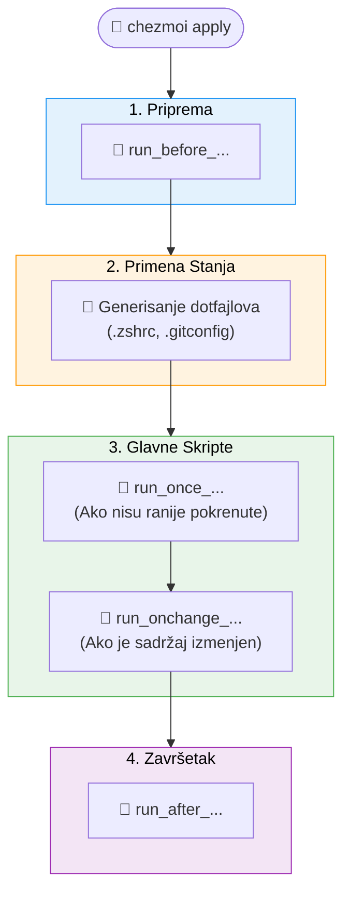

### Primeri

#### 1. Instalacija Paketa (run_onchange_)

Ovo je najkompleksnija i najkorisnija skripta. Ona kombinuje OS detekciju i `is_work` varijablu.

*Chezmoi računa Hash ovog fajla. Ako dodaš novi paket u listu packages, Hash se menja i Chezmoi ponovo pokreće skriptu da bi instalirao novi paket.*

```bash
# run_onchange_install_packages.sh.tmpl

#!/bin/bash

# Lista paketa koje uvek želiš
# Pošto su navedeni ovde, promena ove liste će okinuti skriptu!
packages=(
    curl
    git
    tmux
    vim
)

{{ if eq .chezmoi.os "darwin" -}}
# --- MACOS SEKCIJA ---
echo "Detektovan MacOS. Proveravam Homebrew..."

# 1. Proveri da li je Brew instaliran, ako nije - instaliraj ga
if ! command -v brew &> /dev/null; then
    echo "Brew nije pronađen. Instaliram..."
    /bin/bash -c "$(curl -fsSL https://raw.githubusercontent.com/Homebrew/install/HEAD/install.sh)"
fi

# 2. Instaliraj osnovne pakete
brew install ${packages[@]}

# 3. Instaliraj Slack SAMO ako je ovo poslovni računar
{{ if .is_work -}}
    echo "Poslovni računar detektovan. Instaliram Slack..."
    brew install --cask slack
{{ end -}}

{{ else if eq .chezmoi.os "linux" -}}
# --- LINUX SEKCIJA ---
echo "Detektovan Linux. Koristim apt..."

# 1. Ažuriraj repozitorijume
sudo apt update

# 2. Instaliraj pakete
sudo apt install -y ${packages[@]}

{{ end -}}
```

#### 2. Podešavanje shell-a (run_once_)

Ovu skriptu želiš da pokreneš samo prvi put kada postavljaš mašinu. Nema potrebe da svaki put menjaš shell ako je već Zsh.

```bash
# run_once_setup_shell.sh

#!/bin/bash

# Proveri da li je zsh već default
if [ "$SHELL" != "/bin/zsh" ]; then
    echo "Menjam default shell na Zsh..."
    chsh -s /bin/zsh
else
    echo "✅ Zsh je već default shell."
fi
```

#### 3. Čišćenje i obaveštenje

Ova skripta se pokreće na samom kraju, kada je sve uspešno završeno.

```bash
# run_after_print_success.sh

#!/bin/bash

source ~/.zshrc # učitaj sve izmene u shell-u
echo "----------------------------------------"
echo "🎉 Čestitam! Tvoje okruženje je spremno."
echo "----------------------------------------"
echo "Sve izmene su primenjene."
```
## Upravljanje korisničkim skriptama

Pored automatizacije, postoje ako želiš da dodaš i sačuvaš lične skripte (npr. `git-branch.sh`, `start-dev.sh`) i da one budu dostupne na svakoj mašini potrebno je obratiti pažnju na fajl permisije.

**Git ne čuva uvek precizno fajl permisije**, a kloniranje na različitim sistemima može resetovati dozvole skripti, čineći ih neizvršnim (644 umesto 755).

Chezmoi ovo rešava pomoću `executable_` prefiksa.

### Tok rada

Kada Chezmoi primeni (apply) fajl koji u imenu ima prefiks `executable_`, on će na ciljnoj mašini tom fajlu automatski dodeliti `chmod +x` (dozvola za izvršavanje).

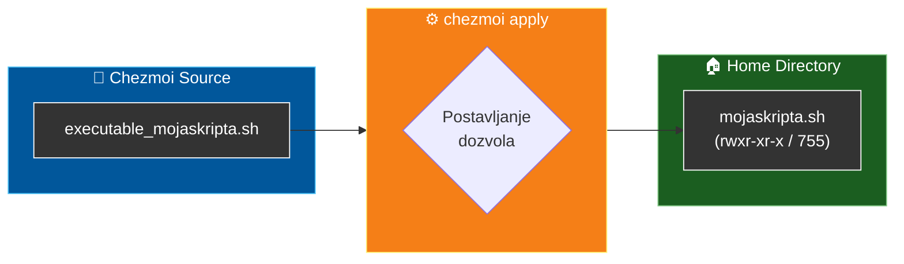

### 1. Dodavanje nove skripte (Automatski način)

Ako fajl dodaješ prvi put, Chezmoi je pametan. Ako je fajl već izvršan na tvom sistemu, Chezmoi će mu automatski dodati prefiks.

```bash
# 1. Napravi skriptu
touch mojaskripta.sh

# 2. Učini je izvršnom (OBAVEZAN KORAK PRE DODAVANJA)
chmod +x mojaskripta.sh

# 3. Dodaj u Chezmoi
chezmoi add mojaskripta.sh
```

**Rezultat:** U Chezmoi repozitorijumu fajl će se zvati `executable_mojaskripta.sh`.

### 2. Popravka postojeće skripte (Ručni način)

Ako si zaboravio `chmod +x` pre dodavanja fajla, ili ako već imaš fajl u repozitorijumu koji nije izvršan, moraš ga ručno preimenovati u Chezmoi direktorijumu.

```bash
# 1. Idi u Chezmoi direktorijum
chezmoi cd

# 2. Preimenuj fajl (dodaj executable_ prefiks)
mv mojaskripta.sh executable_mojaskripta.sh

# 3. Primeni izmenu
chezmoi apply
```

Sada će tvoja skripta uvek biti spremna za pokretanje (`./mojaskripta.sh`) na bilo kojoj mašini koju podesiš.

## Git tok rada (Čuvanje izmena)

Pošto je `~/.local/share/chezmoi` (Chezmoi direktorijum) zapravo običan Git repozitorijum, verzionisanje tvoje konfiguracije je identičan proces kao i rad na bilo kom softverskom projektu.

### Tok rada

Kada napraviš izmenu (npr. dodaš novi alias ili instaliraš novu skriptu), potrebno je da te izmene pošalješ na GitHub:

```bash
chezmoi cd # Pređi u Chezmoi direktorijum
# Verzioniši izmene
git add .
git commit -m "Dodat novi alias za kubectl"
git push origin main
```

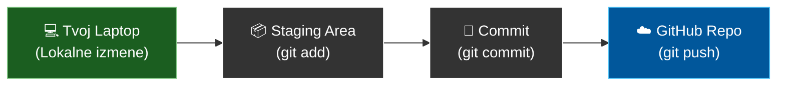

### Automatizacija (Auto push)

Ako ne želiš da ručno kucaš git komande nakon svake sitne izmene, Chezmoi možeš konfigurisati da automatski komituje i šalje izmene na GitHub svaki put kada ažuriraš stanje u repozitorijumu (npr. nakon `chezmoi add` ili `chezmoi edit`).

Ovo se podešava u tvom konfiguracionom fajlu (`~/.config/chezmoi/chezmoi.toml`):

```bash
# ~/.config/chezmoi/chezmoi.toml

[git]
    autoCommit = true
    autoPush = true
    commitMessageTemplate = "{{ .chezmoi.sourceFile }} automatski azuriran"
```

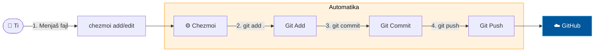

**Prednost:** Nikada nećeš zaboraviti da bekapuješ svoje izmene.</br>
**Mana:** Svaka sitnica (čak i ispravka štamparske greške) pravi novi commit, pa git istorija može postati "prljava".

## Zaključak

Ovaj projekat demonstrira kako se principi modernog softverskog inženjerstva (Infrastructure as Code) mogu primeniti na upravljanje ličnim razvojnim okruženjem.

Šta je postignuto?

* Sigurnost: Uvek znaš šta se menja pre primene (chezmoi diff).
* Brzina: Potpuno podešavanje novog računara traje manje od 60 sekundi.
* Fleksibilnost: Jedan repozitorijum podržava i MacOS i Linux, i Poslovni i Privatni rad.

Sledeći korak je da kloniraš ovaj repozitorijum i prilagodiš ga svojim potrebama!

## Reference

Ako te je Chezmoi zainteresovao, postoje još dosta funkcionalnosti koje nisu pokrivene ovim projektom. Na primer, upravljanje tajnama (secrets) koje takođe mogu biti jako korisne. 

Evo linka do zvanične dokumentacije koju možeš pratiti: https://www.chezmoi.io/
